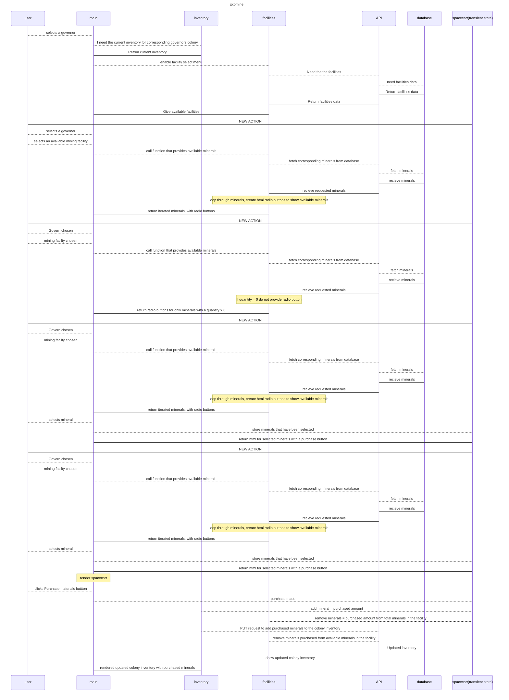

```mermaid
sequenceDiagram
title Exomine

user-->main:selects a governer
main-->inventory:I need the current inventory for corresponding governors colony
inventory->main:Retrun current inventory
main-->facilities: enable facility select menu
facilities -->API:Need the the facilities 
API-->database:need facilities data
database->API:Return facilities data 
API->facilities: Return facilities data 
facilities-> main: Give available facilities


user->spacecart(transient state):NEW ACTION
user-->main: selects a governer
user-->main: selects an available mining facility
main-->facilities:call function that provides available minerals
facilities-->API:fetch corresponding minerals from database
API-->database:fetch minerals
database->API: recieve minerals
API->facilities: recieve requested minerals
note over facilities:loop through minerals, create html radio buttons to show available minerals
facilities->main: return iterated minerals, with radio buttons


user->spacecart(transient state): NEW ACTION
user-->main:Govern chosen
user-->main:mining facilty chosen
main-->facilities:call function that provides available minerals
facilities-->API:fetch corresponding minerals from database
API-->database:fetch minerals
database->API: recieve minerals
API->facilities: recieve requested minerals
note over facilities:If quantity = 0 do not provide radio button
facilities->main:return radio buttons for only minerals with a quantity > 0


user->spacecart(transient state):NEW ACTION
user-->main:Govern chosen
user-->main:mining facilty chosen
main-->facilities:call function that provides available minerals
facilities-->API:fetch corresponding minerals from database
API-->database:fetch minerals
database->API: recieve minerals
API->facilities: recieve requested minerals
note over facilities:loop through minerals, create html radio buttons to show available minerals
facilities->main: return iterated minerals, with radio buttons
user-->main:selects mineral
main-->spacecart(transient state):store minerals that have been selected
spacecart(transient state)->main:return html for selected minerals with a purchase button


user->spacecart(transient state):NEW ACTION
user-->main:Govern chosen
user-->main:mining facilty chosen
main-->facilities:call function that provides available minerals
facilities-->API:fetch corresponding minerals from database
API-->database:fetch minerals
database->API: recieve minerals
API->facilities: recieve requested minerals
note over facilities:loop through minerals, create html radio buttons to show available minerals
facilities->main: return iterated minerals, with radio buttons
user-->main:selects mineral
main-->spacecart(transient state):store minerals that have been selected
spacecart(transient state)->main:return html for selected minerals with a purchase button
note over main:render spacecart
user-->main: clicks Purchase materials buttton
main-->spacecart(transient state): purchase made
spacecart(transient state)-->inventory: add mineral = purchased amount 
spacecart(transient state) --> facilities: remove minerals = purchased amount from total minerals in the facility
inventory-->API: PUT request to add purchased minerals to the colony inventory
facilities-->API:remove minerals purchased from available minerals in the facility
database->API: Updated inventory
API->inventory: show updated colony inventory
inventory->main: rendered updated colony inventory with purchased minerals


```